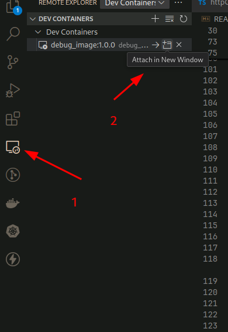

# Debugging typescript in a container

Goal: Demo how to debug a typescript application runnning inside a kubernetes cluster.

Application is a simple express application that exposes 2 apis:

**POSTS API**

It uses [jsonplaceholder.com](https://jsonplaceholder.typicode.com/guide/) to manage posts via custom http client.

Endpoints

- POST /posts : write a post to jsonplaceholder.
- GET  /posts : get a list of posts from jsonplaceholder

Notice that jsonplaceholders never write posts on their side so "*new posts*" are not retrieved via get.

Call examples

```shell
curl --location 'http://localhost:3000/posts'
```
```shell
curl --location 'http://localhost:3000/posts' \
--header 'Content-Type: application/json' \
--data '{
    "title": "post title",
    "body": "some content"
}'
```

**Math API**

Simple calculator to perform mathematical operations

Endpoints

- POST /math/add : add 2 numbers
- POST /math/sub : substract 2 numbers
- POST /math/mul : multiplies 2 numbers
- POST /math/div : divide 2 numbers

Call samples

```shell
curl --location 'http://localhost:3000/math/sub' \
--header 'Content-Type: application/json' \
--data '{
    "a": 5,
    "b": 7
}'
```
All endpoints share the same data format. So, to call them just replace the operation `sub` with any of `mul`, `add` or `div`

# Debugging the application.

The application is written in typescript and we want:

- debug the application by running typescript directly.
- watch for changes such as we do not have to re-deploy the container in the kubernetes cluster every time a file is modified

**Tools**

- nodemon: to watch for changes in files and reload automatically
- ts-node: to run app directly in typescript
- vs-code: for editing files.

## Debugging locally

In this scenario we will use nodemon and typescript and vscode running in the developer machine to debug the application.

### Setting up the nodemon for typescript

Create a nodemon.json config file in the root of source files. Add this content

```json
{
  "restartable": "rs",
  "ignore": [".git", "node_modules/**/node_modules"],
  "verbose": true,
  "watch": ["src/"],
  "execMap": {
    "ts": "node --require ts-node/register"
  },
  "env": {
    "NODE_ENV": "development"
  },
  "ext": "js,json,ts"
}
```

It tells nodemon to:

 - restart the server when we type `rs`
 - ignore the .git directory and any node_modules folder.
 - watch the `src` directory for changes
 - use `ts-node` when invoked with typescript files
 - set the `NODE_ENV` variable to `development
 - take into account only `js,json,ts` for restarting the server

 ### Setting up vscode

 #### Create npm scripts to start the debugger

 In the `package.json` file add the following script

 ```json
 ...
   "scripts": {
    "build": "npx rimraf ./dist && npx tsc",
    "start": "npx ts-node ./src/index.ts",
    "dev": "nodemon ./src/index.ts",
    "dev:debug": "nodemon --inspect ./src/index.ts",
    "test": "echo \"Error: no test specified\" && exit 1"
  },

 ```

 The important one for debugging is `"dev:debug": "nodemon --inspect ./src/index.ts"`

 It tells nodemon to start the debugger. Once we run the script we see an output similar to this one.

 ```text
nodemon] starting `node --require ts-node/register --inspect ./src/index.ts`
[nodemon] spawning
[nodemon] child pid: 73745
Debugger listening on ws://127.0.0.1:9229/f0017928-e5fe-44d8-91d0-cb1c50c0b01c
For help, see: https://nodejs.org/en/docs/inspector
Application running on port 3000
```
#### Configure vscode

Create a `launch.json` inside the .vscode folder or use the vscode to create the file for you.

Add this configuration

```json
{
  "type": "node",
  "request": "attach",
  "name": "Node: Nodemon",
  "processId": "${command:PickProcess}",
  "restart": true,
}
```
It tells vscode to attach the debugger by selecting the process Id. Notice in the previous output the process id was `73745`. When we run this configuration that is the entry we need to select in vscode dialog.

## Debugging inside a container

In this scenario we will run the application inside a container (**not started via vscode**) and attach the debugger to this app.

### Dev Containers extension

Install `Dev Containers` extension. This is required for attach the debugger to container.

- build the image `./scripts/build`
- run the container `./scripts/start`

Using the `dev containers` extension attach the container started previously.



Once the container is attached we are ready to start debugging.

### Configuring vscode for remote debugging.

Important tips:

- the port `9229` should be exposed in the container see this [Dockerfile](./Dockerfile)


Create a new remote attach debug configuration in launch.json file.

```json
{
  "type": "node",
  "request": "attach",
  "name": "Attach to remote readonly",
  "address": "0.0.0.0", // <- remote address here
  "port": 9229
}
```
Notice the address `0.0.0.0` and port `9229` they are important as this is where the port of the container is forwarded.

Then launch this new configuration and that is all the app is ready for debugging.

To detach vccode from the container just use Ctrl+Shift+P then select type `Remote` and select "Close remote connection.


# References

- https://dev.to/oieduardorabelo/nodejs-with-typescript-debug-inside-vscode-and-nodemon-23o7
- https://github.com/remy/nodemon/blob/master/doc/sample-nodemon.md
